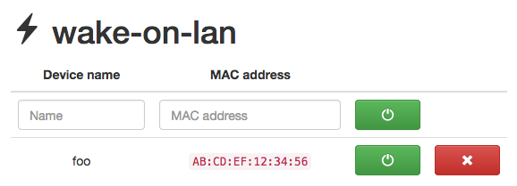

# wakeup

[](https://travis-ci.org/mpolden/wakeup)

`wakeup` provides a small HTTP API and JavaScript front-end for
sending [Wake-on-LAN](https://en.wikipedia.org/wiki/Wake-on-LAN) messages to a
target device.

## `wakeup` usage

```
$ wakeup -h
Usage:
  wakeup [OPTIONS]

Application Options:
  -c, --cache=FILE     Path to cache file
  -b, --bind=IP        IP address to bind to when sending WOL packets
  -l, --listen=ADDR    Listen address (default: :8080)
  -s, --static=DIR     Path to directory containing static assets

Help Options:
  -h, --help           Show this help message
```

## `wakeupbr` usage

```
$ wakeupbr -h
Usage:
  wakeupbr [OPTIONS]

Application Options:
  -l, --listen=IP     Listen address to use when listening for WOL packets (default: 0.0.0.0:9)
  -o, --forward=IP    Address of interface where received WOL packets should be forwarded

Help Options:
  -h, --help          Show this help message
```

## API

Wake a device:

`$ curl -XPOST -d '{"macAddress":"AB:CD:EF:12:34:56"}' http://localhost:8080/api/v1/wake`

A name for the device can also be provided, to make it easy to identify later:

`$ curl -XPOST -d '{"name":"foo","macAddress":"AB:CD:EF:12:34:56"}' http://localhost:8080/api/v1/wake`

List devices that have previously been woken:

```
$ curl -s http://localhost:8080/api/v1/wake | jq .
{
  "devices": [
    {
      "name": "foo",
      "macAddress": "AB:CD:EF:12:34:56"
    }
  ]
}
```

Delete a device:

`$ curl -XDELETE -d '{"macAddress":"AB:CD:EF:12:34:56"}' http://localhost:8080/api/v1/wake`

## Front-end

A basic JavaScript front-end is included. It can be served by `wakeup` by
passing the path to `static` as the `-s` option.



## Bridge

The `wakeupbr` program acts as bridge for Wake-on-LAN packets. The program
listens for Wake-on-LAN packets on the incoming interface and forwards any
received packets to the outgoing interface.

Example:

A device has two interfaces, one wired (`eth0`) with the address `172.16.0.10`
and one wireless (`wlan0`) with the address `10.0.0.10`. The device we want to
wake is on the wired network. We want to pick up Wake-on-LAN packets that are
received on the wireless network and send them out on the wired network. This
can be accomplished with the following command:

```
$ wakeupbr -l 10.0.0.10 -o 172.16.0.10
```

Any Wake-on-LAN packet that is broadcast on the wireless network will then be
forwarded. When a packet is received and forwarded, a message will be logged:

```
2017/07/28 19:34:54 Forwarded magic packet for AA:BB:CC:12:34:56 to 172.16.0.10
```

The command above listens on UDP port 9 for Wake-on-LAN packets. As port 9 is a
privileged port, `wakeupbr` must be run as root. This is less than ideal, but
Wake-on-LAN packets are always broadcast to port 9. To avoid binding to a
privileged port we can use a `iptables` rule:

```
$ iptables -t nat -A PREROUTING -i wlan0 -p udp --dport 9 -j REDIRECT --to-port 9000
```

You should also ensure that traffic to UDP port 9000 is accepted by the `INPUT`
chain:

```
$ iptables -A INPUT -p udp --dport 9000 -j ACCEPT
```

This will redirect all packets on UDP port 9 to port 9000. `wakeupbr` can then
listen on port 9000 and run as a regular user:

```
$ wakeupbr -l 10.0.0.10:9000 -o 172.16.0.10
```
